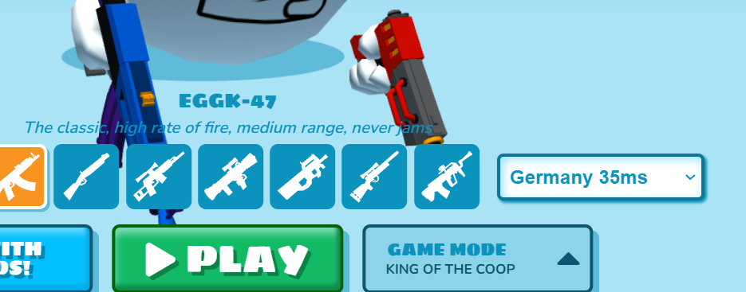
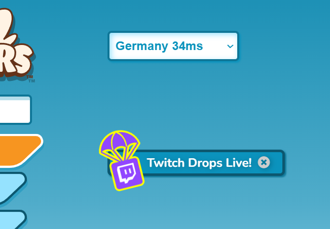

# Shell Shockers Server Dropdown Restorer
Puts back the server dropdown which was removed from the game some years ago. Works with latest interface.

## Links

> \> [GitHub](https://github.com/onlypuppy7/ShellShockersServerDropdownRestorer/)  
> \> [GreasyFork](https://greasyfork.org/en/scripts/527873-shell-shockers-server-dropdown-restorer/)

## Screenshots

*The two configurations.*

